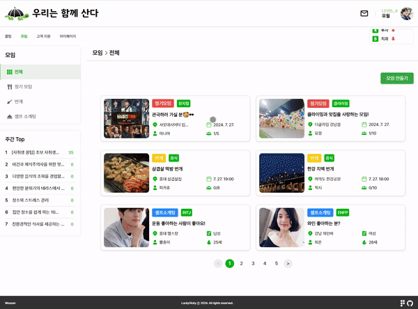
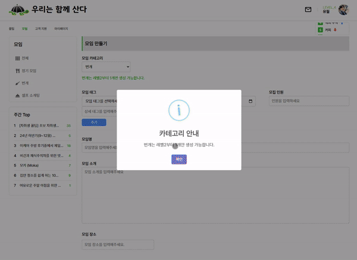
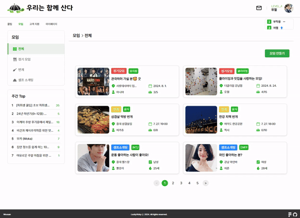
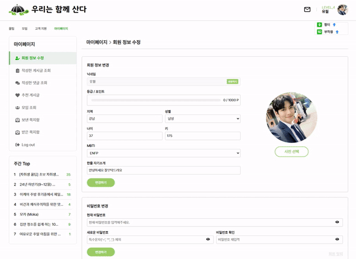
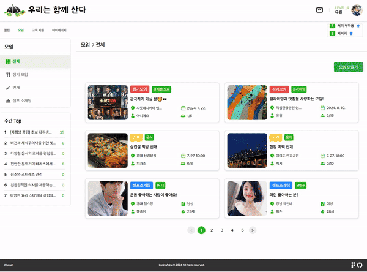
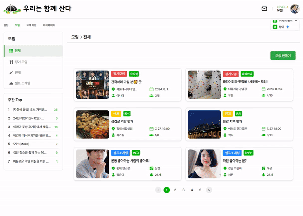

# 모임

우산 프로젝트의 모임 기능입니다. 로그인 사용자들의 레벨에 따라 모임 기능을 사용 할 수 있습니다.

## 주요 기능

- Kakao Map API
  - 지도 검색과 키워드 검색을 결합하여 모임 장소 등록 기능
  
  
  
- Redis를 이용한 조회수 관리
  - Redis에 키와 유효 기간을 설정하여 사용자의 조회 기록을 관리해서 조회수 중복과 조작을 방지하고,
  트래픽이 많아지고 다중 접속 시에도 조회수 업데이트가 실시간으로 정확하게 반영되도록 구현했습니다.

- 자바스크립트 객체를 이용한 모임 구분
  - 필터를 이용한 모임 구분  : 모임 태그 필드를 자바스크립트 객체로 사용하여 다중 필드를 사용하지 않고,
  모임을 대 분류 중 분류로 관리 할 수 있게 만들었습니다. 다중 필드를 사용하는 방식에 비해 데이터 구조의 단순성을 유지하면서,
  확장성과 유지 보수성을 높였습니다.
  
  

## 구현 기능

- 공통
  - 모임 조회
  - 댓글&답글 등록, 삭제
  
- 모임장
  - 모임 생성, 수정, 삭제
  - 가입 신청 승인, 거절
  - 모임원 강퇴

- 모임원
  - 가입 신청, 취소
  - 모임 탈퇴

  
## 기능 실행화면

*모임 회원제한 화면


*모임 조회 화면



*모임 레벨제한 화면


*모임 생성 화면



*모임 카테고리 화면



*모임 셀소 자동폼 화면



*모임 수정 화면



*모임 삭제 화면


*모임 신청 화면



*모임 관리 화면


## 트러블슈팅

- 모임 조회수 관리 문제

  - 문제점: 중복 조회수 계산 및 높은 트래픽 상황에서 조회수의 정확성 저하
  - 해결 방법: Redis를 이용하여 조회수를 관리하고, IP 주소 또는 사용자 ID를 기반으로 중복 조회를 방지하도록 개선
 
## 게시글 조회수 관리 메서드

이 메서드는 게시글의 조회수를 관리하고, 중복 조회를 방지하기 위해 Redis를 사용합니다.

```java
@Override
@Transactional
public void increaseViewCount(Long boardId, Long memberId, Long writerId, HttpServletRequest request) {
    String redisKey; // Redis 키를 저장할 변수
    Duration duration; // Redis 키의 유효 기간

    if (memberId != null) {
        // 사용자가 로그인한 경우
        if (memberId.equals(writerId)) {
            // 사용자가 게시글 작성자인 경우
            redisKey = "viewedBoard_" + boardId + "_writer_" + memberId;
            duration = Duration.ofHours(24); // 24시간 동안 유지
        } else {
            // 로그인한 일반 사용자인 경우
            redisKey = "viewedBoard_" + boardId + "_user_" + memberId;
            duration = Duration.ofMinutes(1); // 1분 동안 유지
        }
    } else {
        // 사용자가 로그인하지 않은 경우 IP 주소를 기반으로 처리
        String ipAddress = getClientIpAddress(request);
        redisKey = "viewedBoard_" + boardId + "_ip_" + ipAddress;
        duration = Duration.ofMinutes(1); // 1분 동안 유지
    }

    // Redis에서 해당 키의 조회 여부 확인
    String hasViewedStr = redisTemplate.opsForValue().get(redisKey);
    Boolean hasViewed = Boolean.valueOf(hasViewedStr);

    if (hasViewed == null || !hasViewed) {
        // 조회되지 않은 경우 조회수 증가
        MatchingBoard board = matchingBoardRepository.findById(boardId)
                .orElseThrow(() -> new MatchingException("매칭 보드를 찾을 수 없습니다."));

        board.incrementViews(); // 엔티티의 조회수 증가 메서드 호출
        matchingBoardRepository.save(board); // 변경된 엔티티 저장

        // Redis에 조회 기록 저장
        redisTemplate.opsForValue().set(redisKey, "true", duration);
    }
}

// 클라이언트의 IP 주소를 가져오는 메서드
private String getClientIpAddress(HttpServletRequest request) {
    String ipAddress = request.getHeader("X-Forwarded-For");
    if (ipAddress == null || ipAddress.isEmpty()) {
        ipAddress = request.getRemoteAddr(); // 기본 IP 주소
    }
    return ipAddress;
}


